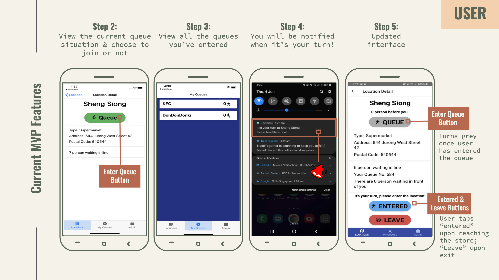

## Qnywhere

**Qnywhere**, a virtual queuing app that allows you to enter a queue virtually so that you only have to physically arrive at the establishment when it is your turn. 

Qnywhere won **2nd Place** at the **Defence Science & Technology Agency's (DSTA) Brainhack CODE_EXP Mobile App Development Hackathon.**

 

What’s unique about Qnywhere is that you are literally able to queue from anywhere, even from your homes. 
As this app was designed to help improve resilience during a health crisis, we aim to reduce the number of people congregating together simultaneously through the usage of our app, Qnywhere, which can mitigate the spread of the virus. 

You can view our slide deck [here](https://docs.google.com/presentation/d/1tyVWqZQNPXyqkARdhmq_Z07v5ulws45viJlpN84I-QY/edit?usp=sharing), which includes more details about the problem statement and our solution.

The app was built over 2 nights with React Native and Firebase.

<!-- Our app was also featured on [Prime Minister Lee Hsien Loong's social media platforms](https://www.facebook.com/leehsienloong/photos/pcb.3405931632802852/3405918406137508/). -->

### Team Members
- Bernice Wan
- Chan Jing Jine
- See Zi Yang
- Wu Jun Chern
